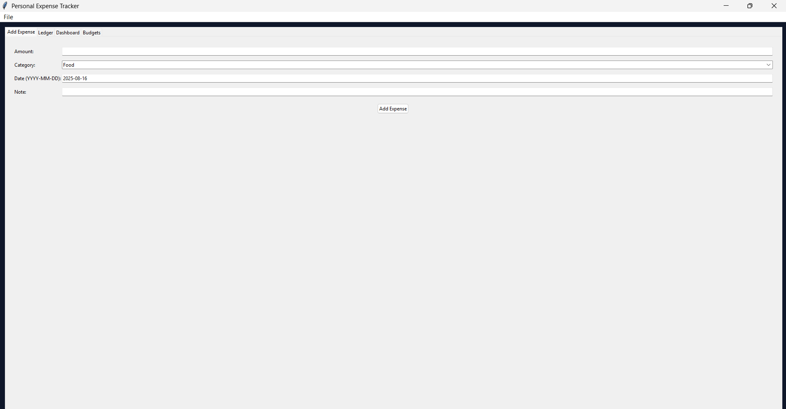
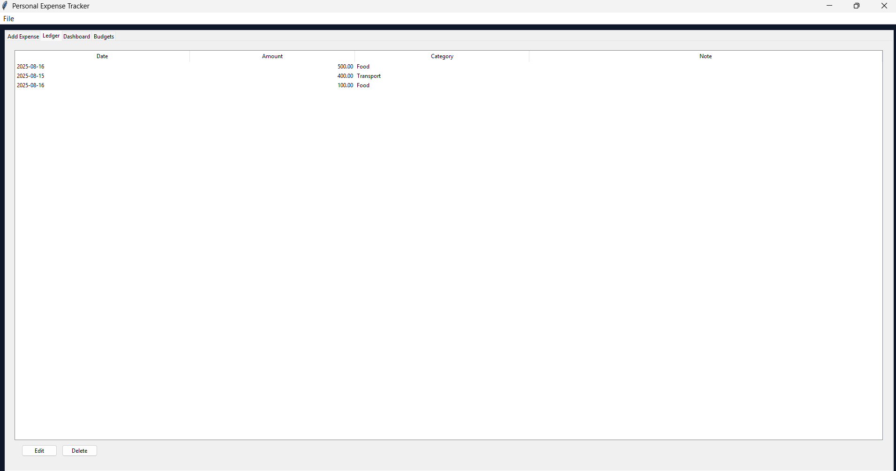
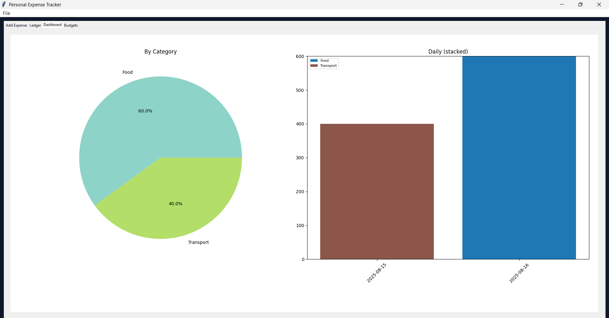
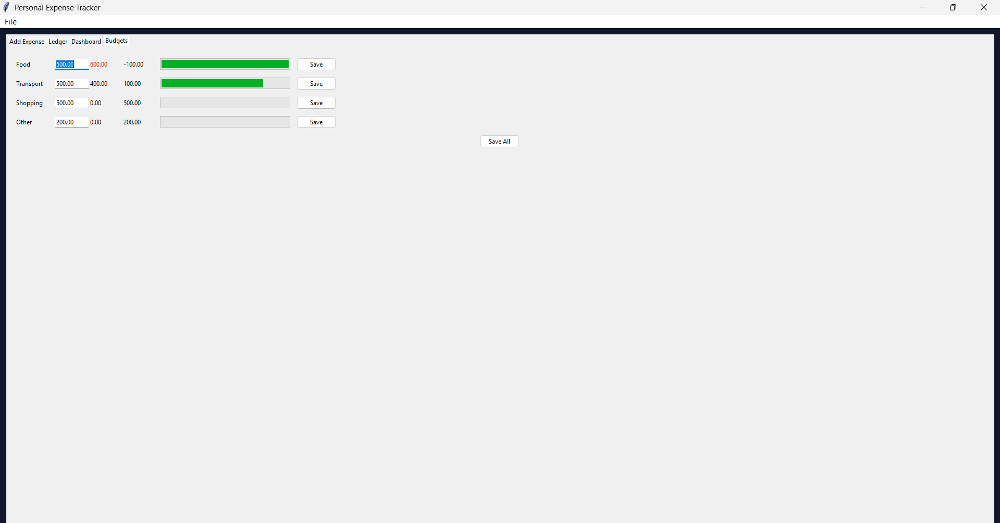
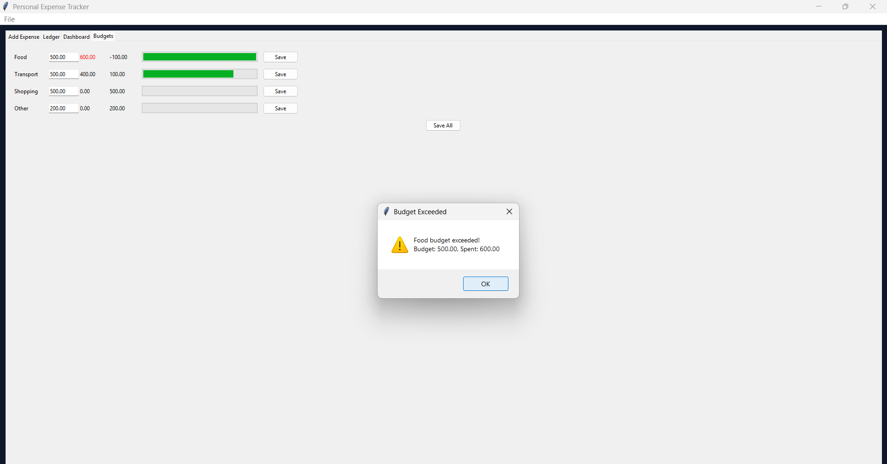
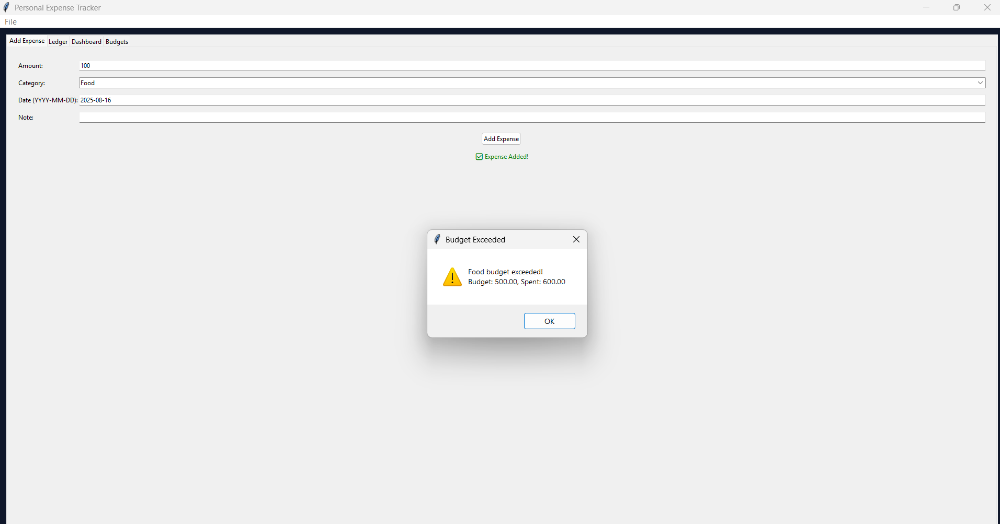
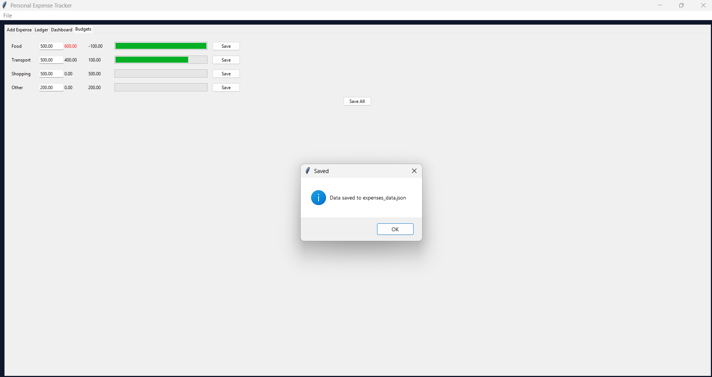

\# 🧾 Personal Expense Tracker

A desktop application built with \*\*Python (Tkinter + Matplotlib)\*\* to manage daily expenses, set budgets, and visualize spending with colorful charts.  

This project is designed as a \*\*Mini Project\*\* with attractive UI and strong functionality.

\---

\## ✨ Features

\- ✅ Add / Edit / Delete expenses  

\- ✅ Ledger table (history of all expenses)  

\- ✅ Dashboard with:

`  `- Pie Chart → Spending by Category  

`  `- Stacked Bar Chart → Daily spending with colored categories  

\- ✅ Budgets tab with progress bars & alerts (red when exceeded, orange near limit)  

\- ✅ \*\*Auto Save/Load\*\* (data stored in `expenses\_data.json`) so data is not lost when you close the app  

\---

\## 🚀 Tech Stack

\- \*\*Python 3\*\*  

\- \*\*Tkinter\*\* → GUI  

\- \*\*Matplotlib\*\* → Charts  

\- \*\*JSON\*\* → Data storage  

\---

\## ▶️ Run the Project

Make sure Python is installed. Then install matplotlib:

\```bash

pip install matplotlib

#Run the App

python personal\_expense\_tracker.py

📂 Project Structure

ExpenseTracker/

│-- personal\_expense\_tracker.py   # Main project file

│-- expenses\_data.json            # Auto-created file to save/load data

│-- README.md                     # Project documentation


👩‍💻 Author

Developed by Chenna Rupa Sree


## 📸 Screenshots

### Add Expense


### Ledger


### Dashboard


### Budgets


### Budget exceed


### Budget extended warning


### Permenant Data storing
